<p align="center">
  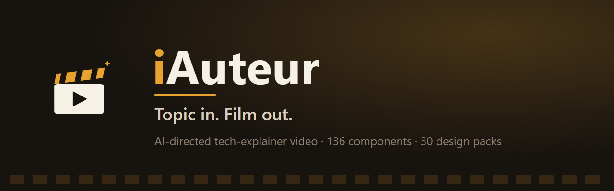
</p>

<p align="center">
  <a href="docs/media/iauteur-made-easy.mp4">
    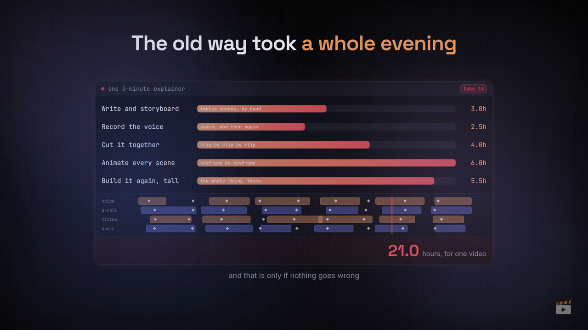
  </a>
</p>

<p align="center">
  <b><a href="docs/media/iauteur-made-easy.mp4">▶&nbsp; Nobody filmed this · 2:51</a></b><br>
  <sub>Twenty-one hours of editing, or this: type one line, copy the question it writes, paste it
  into whichever assistant you already use, paste the answer back, preview a scene, pick a voice —
  and out come four finished videos. Every step on screen, with the app's own progress rail running
  underneath so you always know where you are. Made by this project, about this project. Spec:
  <code>topics/iauteur-made-easy/</code>.</sub>
</p>
<p align="center">
  <a href="https://remotion.dev"></a>
  
  
  
  
  
  
</p>

Turn a **topic** into a finished tech‑explainer video. You (or any LLM) describe the video as a
**JSON spec**; [Remotion](https://remotion.dev) renders it to MP4 — 16:9 long‑form **and** 9:16 shorts,
each in **dark and light**. The project ships a large, audited component library (**157 scene types**)
that automatically reskins across **30 design packs** and **42 themes**.

> **The JSON is the movie.** `topics/<slug>/long.json` + `shorts.json` → Remotion renders exactly what
> the spec says. Scene components are deterministic and read theme tokens, so one spec looks native in
> every design pack and in dark or light with zero extra work.

**This is not a stock‑footage generator.** Every scene is a real, hand‑built animated component — charts,
diagrams, device mockups, timelines — that reads theme tokens and re‑skins itself. A linter counts your
words against per‑component budgets and refuses to render an overfull scene, and animations are anchored
to individual **words** of the narration, so the payoff lands exactly when it's spoken.

**Bring your own model.** The director that writes the JSON is *any* LLM. Point the console at your own
API key (OpenAI, Azure, Groq, OpenRouter, Together, Hugging Face, or a **local Ollama**) and it runs the
whole authoring loop for you — or use no key at all and paste prompts into whatever chat you already have
open. Both paths are first‑class; see [the two ways to author](#the-two-ways-to-author).

---

## 🎬 Make your first video

You do **not** need to understand code. Install two things, run one command, then mostly click buttons.

### 1 · Install the two prerequisites (once, ~10 minutes)

| | What | Where |
|---|---|---|
| 1 | **Node.js** — click the big green **LTS** button and run the installer | [nodejs.org](https://nodejs.org) |
| 2 | **Python** — on Windows, tick **"Add Python to PATH"** during install | [python.org/downloads](https://www.python.org/downloads/) |

Then, in a terminal opened at the project folder, run these two lines once:

```bash
npm install
pip install -r webui/requirements.txt
```

### 2 · Start the console

```bash
python webui/app.py
```

Open **http://127.0.0.1:5000**. You'll see five numbered steps down the left — go top to bottom.

### Step 1 · Topic — say what the video is about

Type your idea (e.g. *"How Wi‑Fi works"*). Paste an article into **Source material** if the facts must come
from a specific source; leave it blank for evergreen topics.

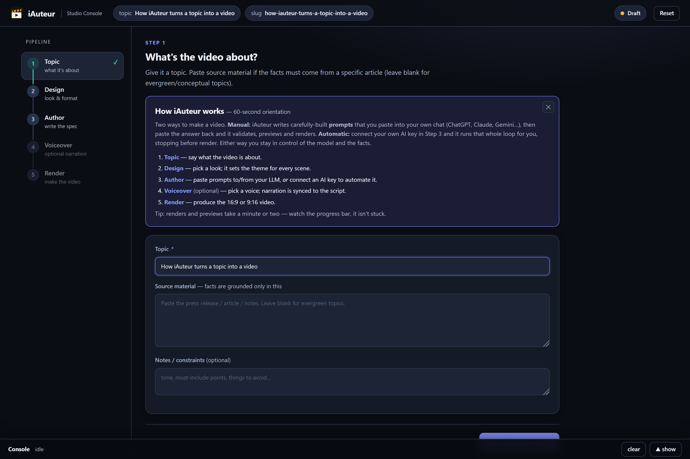

### Step 2 · Design — pick the look

Click a design pack. Each thumbnail is the *same scene* rendered in that pack, so you're comparing like for
like. This one choice sets the theme for every scene in the video.

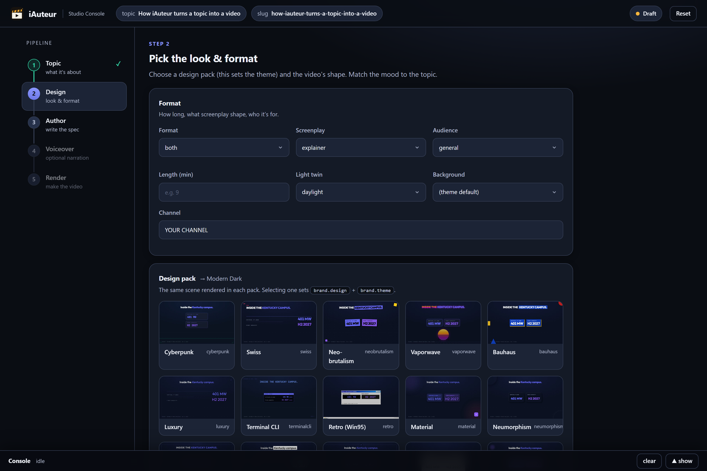

### Step 3 · Author — write the script

This is where the video actually gets written, and there are **two ways to do it**:

**Automatic** — open **AI automation**, paste in an API key (or point it at a local Ollama), and click run.
It writes the beat sheet, fills in every scene, validates, and stops before rendering so you can review.

**Manual (no API key)** — click **Generate beat‑sheet prompt**, **copy**, paste it into ChatGPT / Claude /
Copilot, and paste the reply back. Then do the same for the fill prompt. Slower, but costs nothing and
works with any chat you already pay for.

Either way you land here, with the script laid out beat by beat. The meters count your words against each
component's budget and turn **red** when a line is too long to fit on screen:

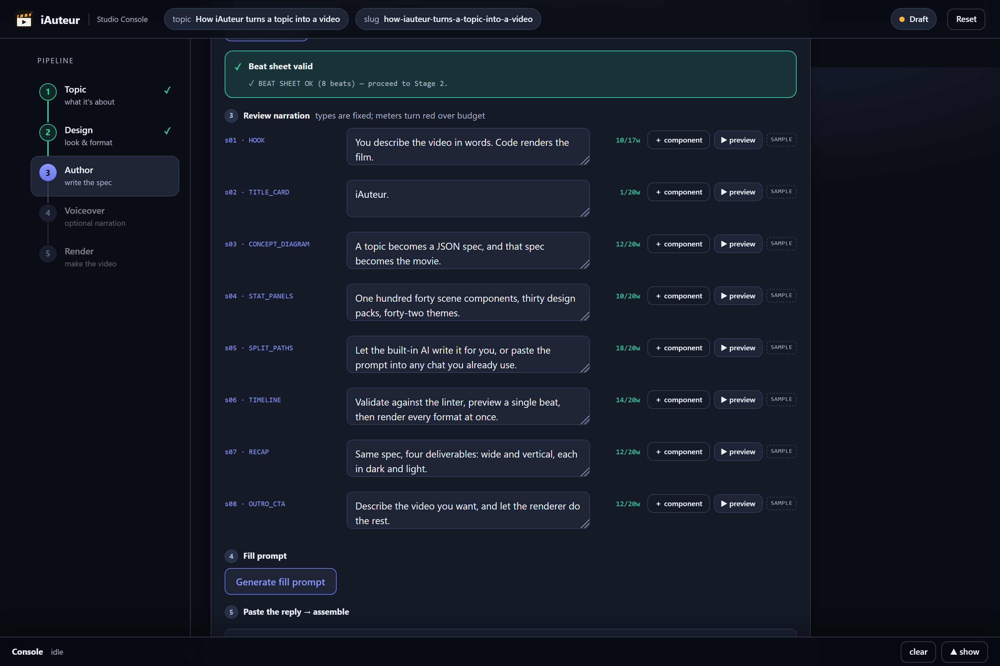

**Preview any beat before committing to a full render.** Click **▶ preview** on any row and it asks once
whether you want narration, then renders just that beat and plays it inline:

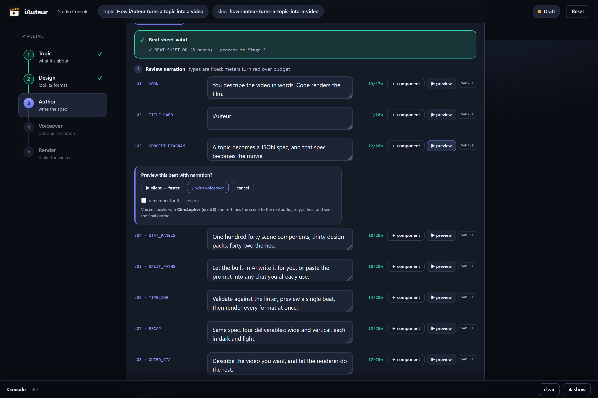

A beat you haven't filled in yet still previews — it uses that component's own sample content and labels it
`SAMPLE`, so you can check the look and motion before writing a single number.

### Step 4 · Voiceover (optional)

Pick a voice and generate. The narration is spoken, then the scene timings are re‑synced to the **real
audio** — so what you saw in the preview is what you get in the render.

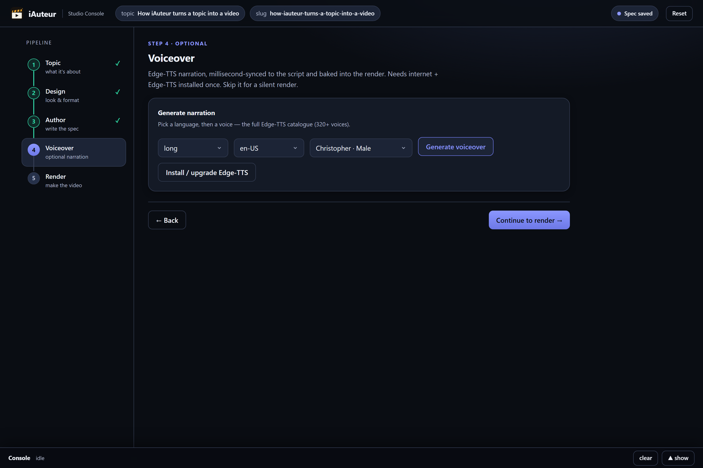

### Step 5 · Render

Click **Render — wide · dark** for the main 16:9 video. The same spec also gives you a light version and
both 9:16 vertical cuts, with no extra work. Progress streams in the console at the bottom; finished files
land under **Outputs** and in `topics/<slug>/out/`.

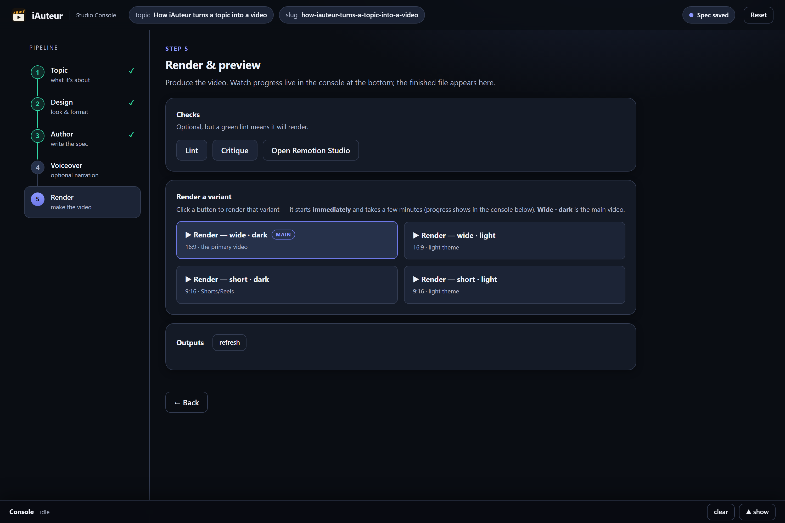

> **Renders take a few minutes.** The first one also downloads a headless Chromium and fonts. Watch the
> progress bar — it isn't stuck.

<sub>Screenshots are generated from the running app by <code>python scripts/docs_shots.py</code>, so they
stay in step with the UI.</sub>

---

## Table of contents
- [🎬 Make your first video](#-make-your-first-video)
- [Showcase](#showcase)
- [What this project is](#what-this-project-is)
- [How it works (architecture)](#how-it-works-architecture)
- [Prerequisites](#prerequisites)
- [Quick start](#quick-start)
- [Make a video from a topic](#make-a-video-from-a-topic)
- [The two ways to author](#the-two-ways-to-author)
- [The Web Console (`webui/`)](#the-web-console-webui)
- [Command reference](#command-reference)
- [Project structure](#project-structure)
- [The component library](#the-component-library)
- [Voiceover & rendering](#voiceover--rendering)
- [Reproducibility — what's committed](#reproducibility--whats-committed)
- [Troubleshooting](#troubleshooting)
- [Repository conventions](#repository-conventions)
- [Credits & attribution](#credits--attribution)

---

## Showcase

A handful of the **157 components**, rendered straight from JSON specs across different design packs
(finance in `corptrust`, science in `organic`) — dark themes shown:

<table>
<tr>
<td align="center">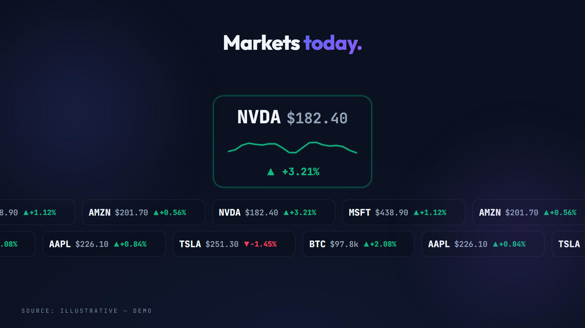<br/><code>TICKER_TAPE</code></td>
<td align="center">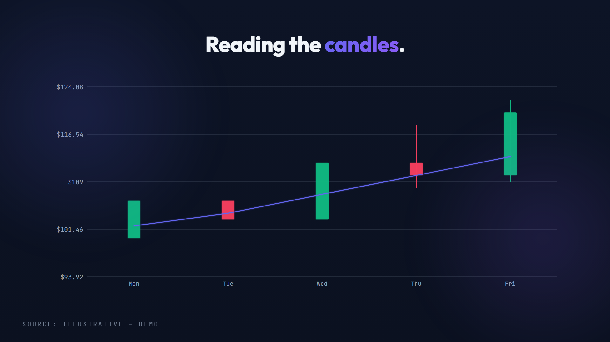<br/><code>CANDLESTICK</code></td>
<td align="center">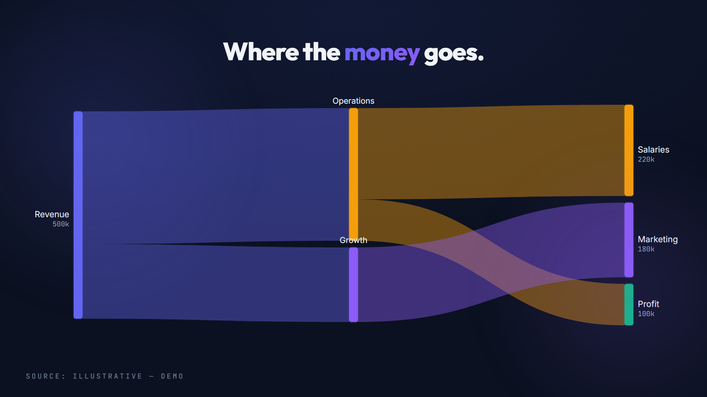<br/><code>SANKEY</code></td>
</tr>
<tr>
<td align="center">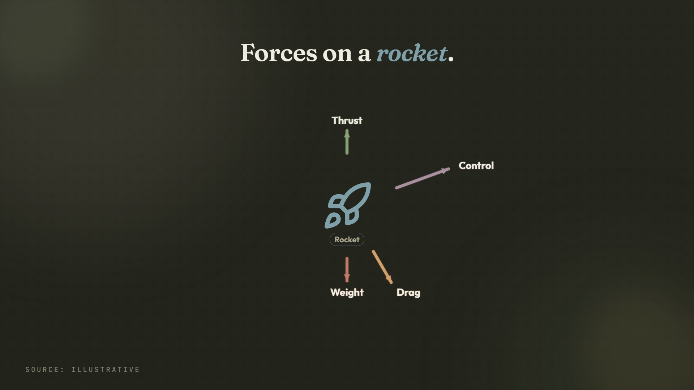<br/><code>VECTOR_FIELD</code></td>
<td align="center">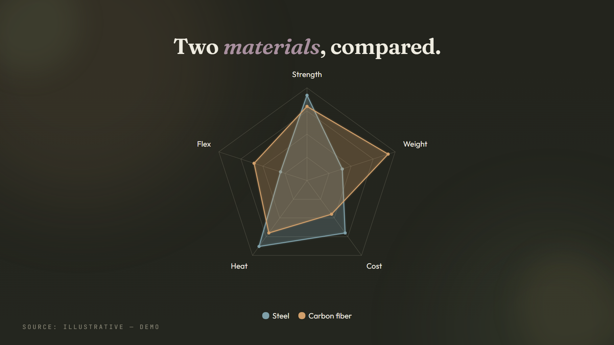<br/><code>RADAR</code></td>
<td align="center">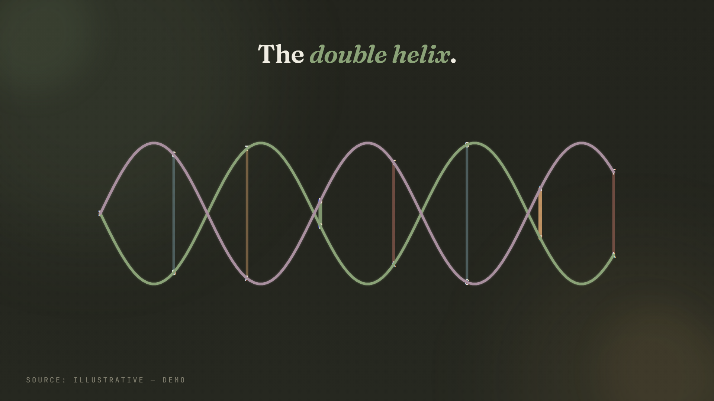<br/><code>DNA_HELIX</code></td>
</tr>
</table>

Each is one deterministic component that reskins across all 30 design packs and dark/light. Browse the whole
library live with `npm run dev` — open any `<design>-wide` composition and scrub.

---

## What this project is

A pipeline that converts a **tech topic** (a bare idea, a title, or a source article) into **renderable
video**. It has three layers:

1. **A spec format** — a JSON document (`meta` + `brand` + `scenes[]` + `thumbnail`/`cover`) that fully
   describes a video. This is the contract between "the idea" and "the pixels."
2. **A render engine** — a Remotion (React) project that maps each `scene.type` to a component, applies a
   theme + design pack, and renders deterministic frames. Same spec → 4 deliverables (wide/short × dark/light).
3. **A director skill** — a Markdown instruction set (`.claude/skills/tech-video-director/`) that teaches an
   LLM how to turn a topic into a valid spec: pick a theme, write a tight script, choose the right components,
   place word‑anchored animations, and pass the linter.

The creative step (topic → spec) is done by an LLM; the mechanical steps (validate, preview, render) are
deterministic scripts. The two never mix — which is what makes the whole thing portable across any AI tool.

## How it works (architecture)

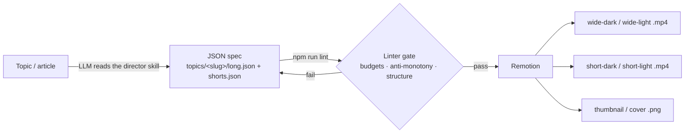

- **Entry:** `src/index.ts` → `src/Root.tsx` registers every Studio composition.
  - Per topic: `<slug>-wide-dark`, `<slug>-wide-light`, `<slug>-short-dark`, `<slug>-short-light`,
    `<slug>-thumb` (1280×720 still), `<slug>-cover` (1080×1920 still).
  - Per design pack: `<design>-wide` / `-short` (the full component showcase) and `<design>-new-wide` / `-new-short` (a focused reel of the newest components).
- **Renderer:** `src/MainComposition.tsx` holds the `scene.type → component` registry. For each scene it
  composes `Background → SceneTransition → SceneFx → the component (+ optional picture‑in‑picture)`.
- **Themes vs design packs:** `brand.theme` is the **dark skin**; its light twin (`brand.themeLight`,
  default `daylight`) renders automatically. `brand.design` optionally selects one of the 30 **design packs**,
  which can override specific components *and* reskins everything else via theme tokens.

## Prerequisites

- **Node.js ≥ 18** (LTS 20 or 22 recommended). `.nvmrc` pins **22** — run `nvm use` if you use nvm.
- **~2 GB free disk** for `node_modules` + Remotion's headless Chromium (auto‑downloaded on the first render).
- **Network on first run** — Remotion fetches Google Fonts and, once, a Chromium binary; both are cached after.
- **Web Console + voiceover:** Python 3.9+ and `pip install -r webui/requirements.txt`
  (Flask + edge‑tts). Optional for the pure‑CLI path, required for the five‑step console above.
- **Optional — AI automation:** an API key from any supported provider, *or* a local Ollama. The provider
  adapter needs no extra package; `litellm` is only for Bedrock / Vertex / Anthropic‑native endpoints.

Everything core runs through `npm` scripts — no global installs required.

## Quick start

```bash
git clone https://github.com/san-gitlogin/iauteur.git
cd iauteur
npm install          # restores exact versions from package-lock.json
npm run dev          # opens Remotion Studio at http://localhost:3000
```

In Studio's left sidebar you'll see the **topic videos** (e.g. `how-llms-work-wide-dark`) and the
**design showcases** (e.g. `material-wide`, `cyberpunk-new-wide`). Press play, scrub the timeline, flip
designs. Editing any `topics/<slug>/*.json` hot‑reloads instantly.

## Make a video from a topic

The end‑to‑end flow. Steps 1 and 3 are done by an LLM (the "director"); the rest are deterministic commands.

**1. Scaffold the topic folder.**
```bash
npm run new-topic -- how-dns-works "How DNS Resolves a Domain"
# creates topics/how-dns-works/{long.json, shorts.json, out/} with empty stub specs
```

**2. Hand the topic to an LLM as "the director."** Point your AI assistant at the skill and ask it to
fill the specs (see [the two ways to author](#the-two-ways-to-author) for exact prompts). The
director follows `.claude/skills/tech-video-director/SKILL.md`, which walks it through:
- pick an **angle** + audience and a **screenplay** preset (explainer / listicle / versus / deep‑dive / documentary / hype‑launch);
- choose a **theme** (rotated so no two videos look alike) and background;
- write a tight, sound‑off‑legible **script** (~150 wpm; `durationFrames ≈ words × 12 + 30`);
- map each beat to the **right component by intent** (a trend → `LINE_CHART`, a comparison → `BAR_COMPARE`, an equation → `FORMULA`, a company → `LOGO_WALL`, …) while obeying the **anti‑monotony law**;
- set **word anchors** (`atWord`) so each element animates in exactly when the narration names it;
- add a `thumbnail` (long) / `cover` (shorts) block;
- run a silent **critic pass** before emitting.

The result is written to `topics/how-dns-works/long.json` and `shorts.json`.

**3. Validate — the render gate.**
```bash
npm run lint            # hard budgets, structure, anti-monotony (nothing renders until this passes)
npm run critique        # optional: qualitative per-scene review
```
Fix the **spec** (never the linter) until it passes.

**4. Preview.**
```bash
npm run dev             # then open how-dns-works-wide-dark, -short-dark, etc.
```

**5. (Optional) Add narration.** See [Voiceover & rendering](#voiceover--rendering).

**6. Render the finished files.**
```bash
npm run render -- how-dns-works wide-dark     # → topics/how-dns-works/out/wide-dark.mp4
npm run render -- how-dns-works short-dark    # → .../out/short-dark.mp4
npm run render -- how-dns-works thumb         # → .../out/thumb.png
```
Variants: `wide-dark` · `wide-light` · `short-dark` · `short-light` · `thumb` · `cover`.

**7. (Optional) Package a standalone bundle** you can zip and hand off:
```bash
npm run package -- how-dns-works              # → dist/how-dns-works-video/ (+ .zip)
```

## The two ways to author

The creative step (topic → spec) needs a language model. The mechanical steps (validate, preview, render)
are deterministic scripts that need no model at all. You choose how the creative step happens.

### A · Automatic — the console drives your model

Open **AI automation** in Step 3, paste an API key, pick a model, and run. The console writes the beat
sheet, casts a component per beat, fills every scene, re‑lints, and applies fix rounds — streaming each
step into the console — then **stops before rendering** so you review before spending render time.

Nine provider shapes are supported out of the box (`webui/ai_providers.json`):

| | Providers |
|---|---|
| **Hosted** | OpenAI · Azure OpenAI · Groq · Together · OpenRouter · Hugging Face |
| **Local** | **Ollama** — point it at `http://localhost:11434`, no key, nothing leaves your machine |
| **Other** | any OpenAI‑compatible endpoint (`custom`), or `litellm` for Bedrock / Vertex / Anthropic‑native |

The adapter (`scripts/ai/provider.py`) uses only the Python standard library — `litellm` is an optional
install needed solely for the non‑OpenAI‑shaped providers.

**Your key stays local.** It's written to a gitignored `.env` and used only by the Flask app on your own
machine. There is no hosted iAuteur service and nothing is sent anywhere except to the provider you chose.

### B · Manual — no key, any chat you already have

The console generates carefully‑built prompts; you paste them into ChatGPT, Claude, Copilot, Gemini,
whatever you use, and paste the reply back. Two prompts (beat sheet, then fill) or one combined prompt for
stronger models. Costs nothing beyond the subscription you already pay for.

This also works entirely outside the console, with a coding agent that can read the repo:

> "Read `.claude/skills/tech-video-director/SKILL.md` and the files it references, then write
> `topics/<slug>/long.json` and `shorts.json` for the topic: **<your topic>**. Follow every law
> (theme rotation, text budgets, anti‑monotony, word anchors, truth). When done, I'll run `npm run lint`
> and paste any errors back for you to fix."

Works with Copilot, Claude Code, Cursor, Cline, Aider, or a local model behind Continue.dev. Smaller local
models do better if you paste `scene_library.md` + `text_budgets.md` inline and work **one scene at a
time**, re‑linting after each chunk.

### Whichever you pick, the guarantees are the same

The model only ever proposes JSON. The linter is the judge — budgets, anti‑monotony, structure, and word
anchors are all enforced by deterministic code, so a bad generation fails loudly instead of rendering an
ugly video.

## The Web Console (`webui/`)

A local **Flask** control panel — the recommended way to drive the whole pipeline.

```bash
pip install -r webui/requirements.txt
python webui/app.py                      # http://127.0.0.1:5000
```

It gives you the five‑step flow shown [above](#-make-your-first-video): topic and source, the 30 design
packs as visual choices, authoring (automatic or manual), per‑beat preview, voiceover, and one‑click
renders — with a live log of every command it runs. It also carries a **Component Lab** for building an
entirely new scene component and wiring it in, type‑checked, with rollback if it doesn't compile.

Design thumbnails come from `out/proof/designs/`; if the gallery is empty, generate them once with
`node scripts/preview-designs.mjs`.

## Command reference

| Command | What it does |
|---|---|
| `npm run dev` | Remotion Studio (live preview) at :3000 |
| `npm run new-topic -- <slug> "Title"` | Scaffold `topics/<slug>/` + regenerate the index (refuses existing slugs) |
| `npm run lint` | Validate every spec — budgets, anti‑monotony, structure. **The render gate.** |
| `npm run critique -- <spec>` | Qualitative per‑scene design review (no arg → all topics + gallery) |
| `npm run render -- <slug> <variant>` | Render one variant → `topics/<slug>/out/`. Variant = `wide-dark`\|`wide-light`\|`short-dark`\|`short-light`\|`thumb`\|`cover` |
| `npm run package -- <slug>` | Build a self‑contained `dist/<slug>-video/` bundle + zip |
| `npm run chapters -- <slug>` | Generate YouTube chapters from scene durations |
| `npm run voiceover -- <slug>` | Generate voiceover **text** (`sceneId\|narration`) from the spec (never hand‑written) |
| `npm run gen-index` | Regenerate `src/topicsIndex.ts` from the `topics/` folders |
| `npm run schema` | Regenerate `specs/video.schema.json` from the component manifest |
| `npm run template -- T1,T2,…` | Print a starter spec skeleton (manifest examples) for the given scene types |
| `npm run typecheck` | `tsc --noEmit` |
| `npm run audit` | Full library gate: census → self‑test → tsc → lint → audio‑check → determinism |

`npm run render` calls `npx remotion render <slug>-<variant>` under the hood; the first render downloads a
headless Chromium automatically.

## Spec schema (the editor floor)

`specs/video.schema.json` is a draft‑07 JSON Schema **derived from the component manifest**
(`scripts/lib/manifest.mjs`) by `npm run schema`. `.vscode/settings.json` binds it to every
`topics/*/long.json`, `topics/*/shorts.json` and `specs/gallery.json`, so the editor gives you
**autocomplete and inline validation** as you author a spec — one source (the manifest) feeds the
LLM prompt, the normalizer, the field validator **and** this schema.

It is a **floor, not the whole law.** The schema checks:

- **shape** — each scene's `data` matches its type (via a per‑type `if type == X then …` branch, all 157 types);
- **enums** — `brand.theme` (dark skins), `themeLight`, `background`, each scene `transition`/`anim`/`background`, `meta.format`;
- **string budgets** — `maxLength` on every text field, mirrored from the linter.

It does **not** check required‑ness, counts, adjacency or cross‑field rules — those belong to the
linter (`npm run lint`). So **schema‑green ≠ lint‑green**: a spec can satisfy the schema and still be
rejected by the linter's deeper rules, but a schema failure is always a real shape/enum/budget error.
`npm run gate` runs `gen-schema --check` to guarantee the committed schema never drifts from the manifest.

## Project structure

```
topics/<slug>/          One folder per video: long.json + shorts.json (+ out/ renders). Immutable once shipped.
specs/gallery.json      Component showcase (every type demoed) — feeds the design-preview compositions.
specs/demo-*.json       Finance + science demo videos that exercise the full library.
src/
  index.ts · Root.tsx   Remotion entry + composition registration (topics + design showcases).
  MainComposition.tsx   Scene registry: maps scene.type → component (157 types).
  types.ts              The spec schema (VideoSpec, Scene, BrandConfig, SceneData…).
  themes.ts             42 themes (38 dark + 4 light) — all colour/font/scale tokens.
  designs/<pack>/       The 30 design packs (per-pack component overrides + chrome + chart kit).
  scenes/               The 134 scene component files.
  charts/ diagrams/ motion/   Chart bodies · the DIAGRAM engine · the animation library.
  ui.tsx · kit.tsx      Shared primitives (Headline, Panel, useScale, useSem, GaugeRing, ChromeFrame…).
  topicsIndex.ts        AUTO-GENERATED by gen-index — never edit by hand.
scripts/                Tooling: lint, render, new-topic, package, chapters, voiceover, audit, gen-index…
.claude/skills/         tech-video-director (the authoring contract) + 30 design-* skills.
webui/                  Optional Flask console (brief builder + pipeline runner).
audit/                  census.json · matrix.md · register.md — the library's audit state.
docs/                   ARCHITECTURE.html.  PROGRAM_3_FINAL.md — component-library build report.
CLAUDE.md · PROJECT_RULES.md   Repo laws and the topic lifecycle (read before large changes).
```

## The component library

**157 scene types** grouped into families — core editorial (HOOK, TITLE_CARD, LIST_BUILD, STAT_CALLOUT,
RECAP, OUTRO_CTA…), charts (LINE_CHART, BAR_COMPARE, DONUT, FUNNEL, WATERFALL, RADAR, CANDLESTICK, SANKEY,
TREEMAP, BOX_PLOT, PICTOGRAM…), diagrams & engines (DIAGRAM, PIPELINE, NEURAL_NET, STATE_MACHINE,
KNOWLEDGE_GRAPH…), code/cloud/AI surfaces (CODE_EDITOR, TERMINAL_SESSION, CLOUD_ARCH, K8S_CLUSTER,
AGENT_HARNESS, RETRIEVAL_RANK…), icons/logos (ICON_GRID, LOGO_WALL, LOGO_VERSUS…), topic‑general set‑pieces
(FORMULA, MOLECULE, DNA_HELIX, CIRCUIT_FLOW, VECTOR_FIELD, TICKER_TAPE, MAP_RADAR…), and a media / creator‑
overlay family (VIDEO_HERO, CAPTION_KINETIC_OVERLAY, PHOTO_TIMELINE…), plus a workflow family that draws
real software rather than diagrams of it (APP_WINDOW, PROMPT_HANDOUT, CHAT_TRIO, VIDEO_PLAYER,
SCENE_FORGE, CHECK_SWEEP, PRODUCTION_GRIND).

Separately from the scene types, a scene can carry a **`stepRail`** — the app-progress chrome drawn by
the shell *over* whatever component the beat uses, so a multi-step walkthrough never loses the viewer.
It composes with all 157 types without any of them knowing about it.

The authoritative, always‑current catalog is `.claude/skills/tech-video-director/references/scene_library.md`
(the "USE WHEN" table + the data shape for each type). `PROGRAM_3_FINAL.md` summarises how the library was
built and audited. To browse them visually, run `npm run dev` and open any `<design>-wide` composition.

## Voiceover & rendering

Specs render silently by default. To add narration (optional, three steps — the last two are run manually
because they need Python/network):

```bash
npm run voiceover -- <slug>                                   # 1. derive voiceover_*.txt from the spec
python scripts/voiceover.py topics/<slug>/long.json <slug>_long   # 2. edge-tts → public/audio/*.mp3 + out/tts/*_timestamps.json
node scripts/sync.mjs topics/<slug>/long.json out/tts/<slug>_long_timestamps.json <slug>_long  # 3. rewrite anchors to exact frames
```
Then `npm run lint` and re‑render. (Requires `pip install edge-tts` and internet for step 2.)

## Reproducibility — what's committed

- **Committed:** all source, specs, topics, design packs, skills, docs, `public/assets/` (images + demo clips
  that specs reference), and `package-lock.json` (exact dependency versions). A fresh `npm install` reproduces
  the toolchain exactly on any machine.
- **Ignored** (see `.gitignore`): `node_modules/`, render outputs (`out/`, `dist/`, `*.zip`), logs, Python
  caches, `.env*`. All regenerated locally — nothing required to run is left out.
- **First run only:** Remotion downloads Chromium once and fetches Google Fonts over the network.

## Troubleshooting

- **`npm run render` can't find the composition** — run `npm run gen-index` (regenerates `src/topicsIndex.ts`
  so new topics register), then retry. Confirm the spec passes `npm run lint`.
- **A spec won't render / lint fails** — the linter prints the exact budget or structure error; fix the spec,
  never the linter. Text over budget → shorten the idea, don't shrink the font.
- **Studio shows a webpack "Restoring failed … Expected end of object" warning** — a stale build cache; it's
  discarded and rebuilt automatically. Harmless. Delete `node_modules/.cache` to silence it.
- **Fonts or Chromium fail to download** — you're offline; connect once so Remotion can cache them.
- **Design gallery empty in the Web Console** — run `node scripts/preview-designs.mjs` to generate the
  thumbnails into `out/proof/designs/`.

## Repository conventions

- **Topics are immutable** once shipped — `new-topic` refuses existing slugs; create a new one instead.
- **`brand.theme` must be a dark theme**; the light twin renders automatically. Rotate themes across videos.
- **Truth first** — facts come only from a provided source or a live search; never invent stats, quotes, or dates.
- **Text budgets are law**, enforced by the linter. Deterministic motion only (no unseeded randomness).
- Building or changing a **component** is a code job that follows
  `.claude/skills/tech-video-director/references/component_authoring.md` (six wiring files + both‑aspect proofs).
- `CLAUDE.md` and `PROJECT_RULES.md` hold the full working rules — read them before large changes.

## Credits & attribution

This project was built **on top of** the work below, using AI assistance (Claude / Claude Code). The
scene components and motion in `src/` are original, deterministic re‑implementations, but the ideas,
template vocabulary, and design languages were learned and adapted from these sources — full credit to them:

- **[Remotion](https://remotion.dev)** — the React video‑rendering engine this whole project runs on.
  Note Remotion's own [license](https://remotion.dev/license) (free for individuals & small teams; larger
  companies need a paid licence).
- **ReactVideoEditor (RVE) — Remotion Templates** · <https://github.com/reactvideoeditor/remotion-templates>
  (demos: <https://www.reactvideoeditor.com/remotion-templates>). RVE's collection of 81 free Remotion
  templates is where this project's animation/component vocabulary was learned and built on top of.
- **DesignPrompts** · <https://www.designprompts.dev/> — source of the 30 design‑language prompts in
  `design_variations_prompts/`, which the 30 design packs (`src/designs/`) and `design-*` skills are adapted from.
- **Icons & logos** — [Lucide](https://lucide.dev) (ISC) for glyphs and [Simple Icons](https://simpleicons.org)
  (CC0) for brand logos, rendered via `src/AssetIcon.tsx`. Brand logos are used nominatively; see
  `.claude/skills/tech-video-director/references/asset_rules.md`.
- **AI assistance** — scaffolding, components, and docs were developed with Claude / Claude Code.

Trademarks and brand logos belong to their respective owners. If you redistribute this repository, keep this
section and honour each upstream project's licence.
