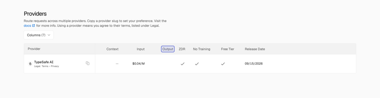
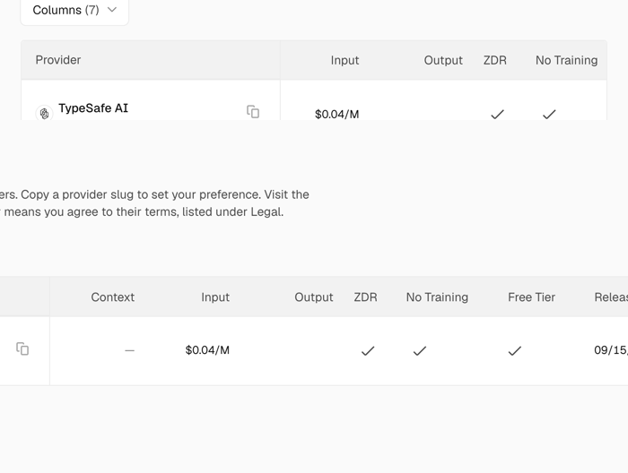

# Zoom and highlight at CAPTURE time, not after it

**Status:** proposal, with the mechanism verified. Nothing implemented yet.
**Written:** 2026-09-19, after the Jev shorts. Owner: *"If we could utilize playwright's capability
to zoom in properly to a specific position perfectly then it would be great."*

---

## 1. The problem, stated precisely

Today a zoom is a POST-PRODUCTION move. The recorder films a page at one scale and measures a
mark once; the renderer later re-derives a window and scales the footage into it. Three coordinate
spaces are involved — capture pixels, stage pixels, and the frame — and one measurement has to
stay true across all of them for the whole clip.

It does not stay true, and the Jev shorts showed every way it fails:

| symptom | what was actually wrong |
|---|---|
| highlight sits slightly off its word | the vertical stage cover-cropped a 16:9 capture to 0.8, so the box was measured against a frame the viewer was not seeing |
| highlight in empty white space | the zoom fired while the clip was still scrolling — the band drew at the mark's FINAL rect over a frame that had not arrived there yet |
| zoom framed the wrong part of the page | the mark said `Output` was at `y=253`; in that segment's own footage the table sat far lower. One rect, measured once, cannot describe a moving picture |
| callouts on a screenshot all landed in blank space | `MEDIA_CALLOUT` fills 16:9, so a portrait image was cropped and every fraction pointed off-screen |

Four different bugs, one root cause: **the annotation and the picture are produced by different
systems at different times, and nothing forces them to agree.**

Every fix so far has been a patch on one symptom. The structural answer is to stop separating them.

---

## 2. The proposal

Let Playwright do both jobs **while the camera is rolling**, so the highlight and the zoom are part
of the pixels:

- **Highlight** — inject an absolutely-positioned overlay into the page DOM, on the element.
  It is in the page's own coordinate system, so it cannot drift by construction. It scrolls when
  the page scrolls, reflows when the page reflows, and is captured as part of the frame.
- **Zoom** — scroll the target to the centre and change the page's scale before capturing.
  The recording then *contains* the zoom at full resolution. No upscaling, no window maths, no
  `masterWidth` arithmetic to survive a 3.2× digital punch-in.

The renderer's job shrinks to what it is good at: play the clip.

---

## 3. What was verified (2026-09-19, headless, against the real Vercel page)

**Highlight injected into the DOM — pixel-exact.**
`element.getBoundingClientRect()` → an absolutely-positioned `div` with `z-index: 2147483647`.



The box sits exactly on `Output`, with the row beneath it legible — the shot the short wanted and
never got. Note the measured rect: **`{x: 684, y: 440}`**. The mark baked into our recording says
`y: 253`. That 187px gap IS the bug we spent the evening chasing.

**Centring — `scrollIntoView({block: 'center', inline: 'center'})` works and is reliable.**
The element lands at y≈440 of a 900px viewport. Centring is the page's job, not the camera's.

**Three zoom mechanisms tested:**

| mechanism | result |
|---|---|
| CDP `Emulation.setDeviceMetricsOverride` with `scale: 2.2` | **does nothing to the pixels.** Accepted without error, screenshot unchanged. A trap worth recording |
| CDP `Emulation.setPageScaleFactor` | accepted; output 3199px wide vs 3200 — i.e. essentially no effect on a desktop page. Not the tool |
| **CSS `documentElement.style.zoom`** | **works.** Genuine zoom, crisp text, layout reflows (acceptable — it is what a real user's browser zoom does) |
| **high `deviceScaleFactor` + screenshot `clip`** | **works, and is lossless.** A crop of an already-high-resolution render. No reflow at all |



*Top: CSS zoom at 2.2×. Bottom: a clip of the high-dsf render. Both crisp; the clip keeps the
layout identical to the wide shot, which matters for cutting between them.*

---

## 4. Recommended design

**Prefer the clip approach** (`deviceScaleFactor: 4` + per-frame crop). It keeps the layout byte-
identical between the wide shot and the zoomed one, so a cut between them reads as a camera move
rather than a different page. CSS zoom is the fallback for a page that needs genuinely larger text.

Two new demo-step fields:

```jsonc
{
  "id": "outputcol",
  "action": "scroll",
  "target": "text=Providers",
  "centre": "text=Output",          // scrollIntoView({block:'center'}) — the page centres itself
  "highlight": {                     // drawn IN THE PAGE, so it cannot drift
    "target": "text=Output",
    "label": "no output tokens at all"
  },
  "zoom": 2.2,                       // capture-time, via clip of a high-dsf render
  "holdMs": 4000
}
```

What this removes from the spec side: `clips[].zooms`, `clips[].marks`, the band, and the
`masterWidth` floor that only exists to survive a digital punch-in. What it removes from the
renderer: `windowFor`, the stage-aspect negotiation, and the mark→stage mapping — three of the
places today's drift comes from.

**Migration is additive and safe.** The new fields are opt-in per step. Existing demos keep
working through the current path; new takes use the capture-time path. Nothing shipped needs
re-recording.

---

## 5. Risks and open questions

- **Reflow on CSS zoom** — sticky headers and `position: fixed` elements move. The clip approach
  avoids this entirely, which is why it is the default recommendation.
- **A moving zoom** (a push-in over time, rather than a cut to a zoomed shot) needs the crop rect
  animated per frame in the recorder. Worth deciding whether we want a *move* at all, or whether
  a cut between a wide take and a tight take is better television. A cut is cheaper and cannot
  drift.
- **The label still has to be placed** — the overlay solves the box, not the leader line. Simplest
  version: put the label inside the injected overlay, anchored to the element, and let the page's
  own layout keep them together.
- **`check-camera` becomes unnecessary** for these beats, because there is no camera to check;
  the guard should skip clips recorded this way rather than reporting "no zooms to check".

---

## 6. First thing to do

One throwaway take against a page we already film — `jev-vercel` is the obvious candidate, since
its failure is documented above. Record two steps: the wide row, and the same row centred,
highlighted and zoomed at capture. Put them side by side and look. That is a ten-minute job and it
either proves the whole approach or kills it before anything is built on top of it.

If it proves out, the order is: recorder support → one new demo → one short → then retire the
post-hoc path for browser takes.
